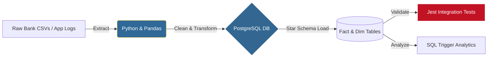

# 💓 Pulse | Behavioral Intelligence & Financial AI

**Pulse** is a high-fidelity behavioral intelligence system designed to detect spending rhythms and emotional triggers. By correlating financial velocity with behavioral metrics, Pulse provides a "Truth-Forward" diagnostic of personal capital trajectory.

---

## ⚡ System Heuristics

- **Behavioral Mirroring Engine:** Real-time detection of spending "triggers" by correlating discretionary expenditure with mood indices.
- **Nova AI Consultant:** A sophisticated conversational logic engine that provides proactive behavioral coaching and capital-preservation strategies.
- **Capital Trajectory Analysis:** High-fidelity growth projections and end-of-month balance forecasting based on current velocity.
- **Protocol-Driven UX:** Dynamic dashboard that adapts its tone and insights based on the user's selected protocol (Aggressive, Empathetic, or Balanced).

---

## 🏗️ Financial User Behavior Pipeline: Tracking Impulse Triggers
### From Raw Bank Logs to Impulse Spending Metrics using Python, PostgreSQL, and Jest

### Architecture Decisions: The "Why"
- **Python (Pandas)**: Bank statement data and user logs are notoriously messy. I utilized Pandas for its superior data-wrangling capabilities to standardize date formats, handle missing merchant data, and apply initial categorization (e.g., flagging late-night purchases as potential impulse triggers).
- **Postgres (Star Schema)**: To extract behavioral insights, I designed a relational Star Schema. By separating the data into a Fact table (Transactions) and Dimension tables (Users, Merchants, Emotional Triggers), the AI and analytics engine can rapidly slice spending habits by mood, time of day, and category.
- **Jest (Testing)**: When dealing with personal finance data, accuracy is critical. I integrated Jest to run child-process integration tests that validate the Python ETL pipeline, proving that the code is production-ready, testable, and mathematically accurate (e.g., ensuring debits/credits are correctly routed).

---

## 🛠️ Technical Architecture

| Component | Technology | Engineering Principle |
| :--- | :--- | :--- |
| **Data Ingestion** | Python 3.12, Pandas | Grouped Imputation & Ordinal Mapping |
| **Warehouse** | PostgreSQL, Star Schema | Relational Integrity & Query Optimization |
| **Frontend** | React 19, TypeScript, Vite | Zero-Latency Component Logic |
| **Backend** | Node.js, Express, RESTful API | Modular Micro-Service Integration |
| **Validation** | Jest, Python Unittest | End-to-End Automated Reliability |
| **Intelligence** | Nova Analytical Engine (Gemini Pro) | Advanced Pattern Recognition |

---

## 💎 Product Strategy

Pulse is engineered for the **Mindful Capitalist**. It moves beyond standard "budgeting" to offer a deep-dive into the *psychology* of spending. It serves as the financial conscience of the DTE Ecosystem, ensuring data-integrity and behavioral alignment.

- **Status**: Operational // Full-Stack Integration.
- **Logic**: Nova AI fully synchronized with behavioral onboarding.

---

## 👤 System Architect

**Drew T. Ernst**  
*Senior Systems Engineer // Analytical Lead*

Part of the [DTE Nexus](https://dte-solutions.icu). Optimized for behavioral finance.

*© 2026 DTE Solutions LLC. All systems operational.*
